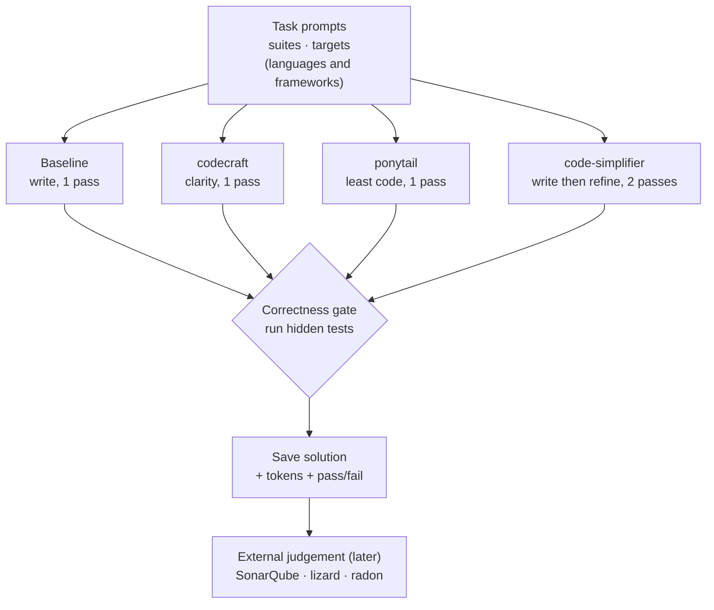

# codecraft vs. code-simplifier

A topic-by-topic comparison between codecraft and Anthropic's official
`code-simplifier` plugin. codecraft does not try to compete with
`code-simplifier`: they are different kinds of tool that run at different
moments. This document makes the overlap and the complementarity explicit, and
it defines a follow-up benchmark to measure them empirically.

Sources reviewed in full: `anthropics/claude-plugins-official`, the
`plugins/code-simplifier` plugin (`.claude-plugin/plugin.json`,
`agents/code-simplifier.md`) and the `plugins/pr-review-toolkit` variant of the
same agent. code-simplifier ships only an agent definition: no hooks, no skill,
no commands.

## TL;DR

- **code-simplifier** is a post-hoc **subagent**. The main model writes the code
  first, then the subagent is launched (via the Task tool) to rewrite the
  recently touched code for readability, without changing behavior. It is a
  cleanup pass after the fact.
- **codecraft** is a readability **standard and lens** applied while the code is
  being written. Its principles sit in the main model's context, so the first
  draft is shaped as it is produced. There is no separate agent and no second
  pass.
- They are complementary: codecraft aims for a better first draft;
  code-simplifier is a cleanup safety net afterwards.

## How each one activates (the part that is easy to confuse)

**code-simplifier: write first, then refine (two passes).** The agent operates
"autonomously and proactively, refining code immediately after it's written",
and it "analyzes recently modified code". The pr-review-toolkit examples show
the flow directly: the assistant writes a feature, then launches the
code-simplifier agent through the Task tool to refine it. So the code is written
by the main model first and rewritten by the subagent second. It does not
produce clean code directly in one pass.

**codecraft: shape during writing (one pass).** The principles are injected into
the main model's context (the SessionStart hook for the plugin, or the skill
body when the skill is triggered), so the same model that writes the code
already has the lens applied. There is no second agent and no rewrite step.

## Topic-by-topic

### Delivery and mechanism

| Topic | codecraft | code-simplifier |
| --- | --- | --- |
| Type | skill plus hooks (or a plain skill) | agent (subagent) only |
| When it runs | during writing | after writing, a second pass over recent code |
| Activation | always-on via hooks, or intent-gated skill, or `/codecraft` | autonomous after a chunk, launched via the Task tool |
| Cost profile | context injection | a full separate Opus pass |
| On/off toggle | yes (flag file) | no |
| Source of standards | its own SKILL.md | reads project standards from CLAUDE.md |

### Readability principles

| Topic | codecraft | code-simplifier |
| --- | --- | --- |
| Obvious over clever | yes, the north star | yes, one line |
| Explicit tie-break hierarchy for conflicts | yes (clarity over brevity over DRY over SOLID over magic) | no ordering given |
| Kent Beck's four rules of simple design | yes, in order | no |
| Full, intention-revealing naming | yes (principle 2) plus examples | yes, one line |
| Guard clauses and flat control flow | yes (principle 4) plus examples | yes ("reduce nesting") |
| Avoid nested ternaries | implied | yes, explicit |
| Document public contracts | yes (principle 8) | no (leans the other way: "remove obvious comments") |
| Honest error handling | yes (principle 9, catch specific errors) | project-specific ("avoid try/catch when possible") |
| Keep side effects at the edges | yes (principle 10) | no |
| Clarity beats DRY | yes (principle 6) | mixed ("eliminate redundant code" and also "keep helpful abstractions") |
| SOLID applied with judgement (DIP, OCP, SRP) | yes, with examples | no |
| Named code smells (feature envy, primitive obsession, boolean traps, magic numbers, dead code) | yes, listed | generic only ("reduce complexity and redundancy") |
| Prose style rule (no dash as a clause connector) | yes (principle 11) | no |
| Remove obvious comments | qualified (document the why, not the what) | yes, explicit |

### Language coverage

| Topic | codecraft | code-simplifier |
| --- | --- | --- |
| Per-language worked before/after examples | yes (python, typescript, javascript, react, go, java, csharp, plus a language-agnostic file) | no examples |
| Project conventions (ES modules, `function` keyword, return types, React Props) | no, it is language-agnostic | yes, but hardcoded and JavaScript/TypeScript centric |
| Language-agnostic | yes | no (the agent body names JavaScript/TypeScript conventions) |

### Balance and scope

| Topic | codecraft | code-simplifier |
| --- | --- | --- |
| Restraint ("leave clear code alone") | yes, explicit | partial ("avoid over-simplification", but it still acts on all recent code) |
| No premature abstraction (YAGNI) | yes | yes ("keep helpful abstractions") |
| Do not combine separate concerns | qualified | yes, explicit |
| Preserve behavior | yes (it is a style lens) | yes, central and repeated |
| Out of scope: performance, security, architecture | yes, stated | implied, not stated |

## Synthesis

- **code-simplifier** is a post-hoc, JavaScript/TypeScript-flavored agent with a
  flat list of guidelines, no conflict-resolution hierarchy and no worked
  examples, pulling project standards from CLAUDE.md. It is strong at rewriting,
  thin as a doctrine.
- **codecraft** is a documented, opinionated, multi-language readability standard
  applied during writing: an explicit tie-break hierarchy, Beck's rules, SOLID
  with judgement, named smells, per-language examples, a restraint rule and a
  prose rule. Its weakness is that it is a probabilistic in-context nudge, not a
  forced rewrite.

Put simply: code-simplifier covers the "what" shallowly and rewrites afterwards;
codecraft covers the "what", how to resolve conflicts, and per-language examples
in depth, and shapes the code beforehand. Different categories: a cleanup agent
versus a readability standard and lens.

## The benchmark: generate, save, let others judge

The tables above are a static analysis of the two definitions, not measured
results. This section defines the empirical benchmark. Its scope is deliberately
narrow: **it generates code under each mode and saves it, recording only
objective signals, tokens and correctness.** It does not score quality,
readability, or simplicity. Judging those is a solved problem with established
tools (SonarQube, lizard, radon, and research readability models); rolling our
own metric would only add an unvalidated number of our own taste. So we produce
the artifacts and leave the judgement to those tools, run later over the saved
solutions.



### Stages

1. **Generation.** Four arms, each run by a fresh agent with no prior context,
   solving the same task in the same language. Token usage is recorded per arm.
   - **Baseline**: writes the code with no readability tooling. The control.
   - **codecraft**: writes the code with the codecraft lens active (clarity first,
     "clarity beats brevity"). One pass.
   - **ponytail**: writes the code with the ponytail skill active (least code
     first, "one line before fifty"). One pass. A brevity-first foil to
     codecraft's clarity-first lens, using the same always-on hook mechanism.
   - **code-simplifier**: writes the code normally, then runs the code-simplifier
     agent to refine it. Two passes.
2. **Correctness gate.** The hidden tests run against each solution, recording
   pass or fail. This is objective execution, not a quality opinion: it only
   says whether the code produces the right outputs.
3. **Save.** The solution and a `metrics.json` (tokens in/out, pass/fail) are
   written under the output path. Nothing about quality is computed here.
4. **External judgement (later, out of scope for the harness).** Whoever wants a
   quality read runs established tools over the saved solutions, SonarQube
   (cognitive complexity, code smells, issue counts), lizard (cyclomatic
   complexity and function length across languages), radon (maintainability
   index for Python). These are recognized, documented metrics, so the judgement
   is theirs, not ours.

The harness answers only: on the same tasks, at what token cost does each mode
reach working code? Whether codecraft's clarity or ponytail's brevity is
"better" is not ours to score, the saved solutions are the evidence, and the
external tools (or a human) render that verdict.

### Folder layout

```
comparison/
  COMPARISON.md   # this document
  tasks/          # prompts + hidden tests, as tasks/<suite>/<task>/<target>/ (present)
  results/        # per-run solutions + metrics.json (tokens, pass/fail)
```

Targets are languages or frameworks, so the same layout extends from the current
algorithmic suite to future language and framework suites without changing shape.
See `tasks/README.md` for the live coverage.
